

  

# Erevos – Static PE Disassembler & Forensic Toolkit

Erevos is a **static analysis toolkit** for Windows PE executables.  
It provides investigators, reverse engineers, and malware analysts with an intuitive interface to explore binaries, extract forensic artifacts, and generate professional reports.  

Whether you’re performing **malware triage**, **reverse engineering**, or **incident response**, Erevos gives you the visibility you need into suspicious executables.

---

## 🔹 Key Features

- **PE Metadata Overview** – inspect sections, headers, and entropy values.  
  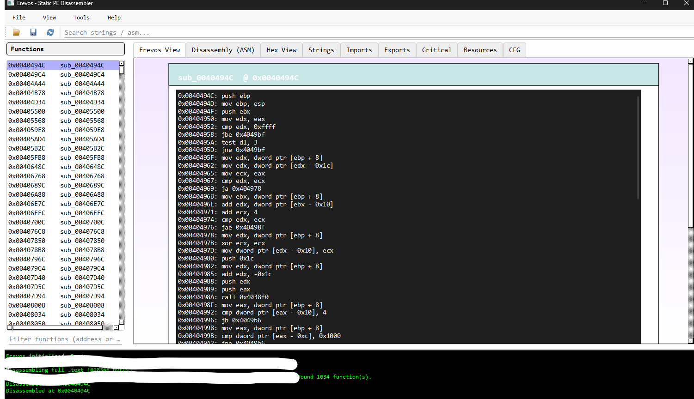

- **Disassembly Viewer (ASM)** – Capstone-powered disassembly with syntax highlighting.  
  

- **Hex View** – raw hexadecimal view for byte-level inspection.  
  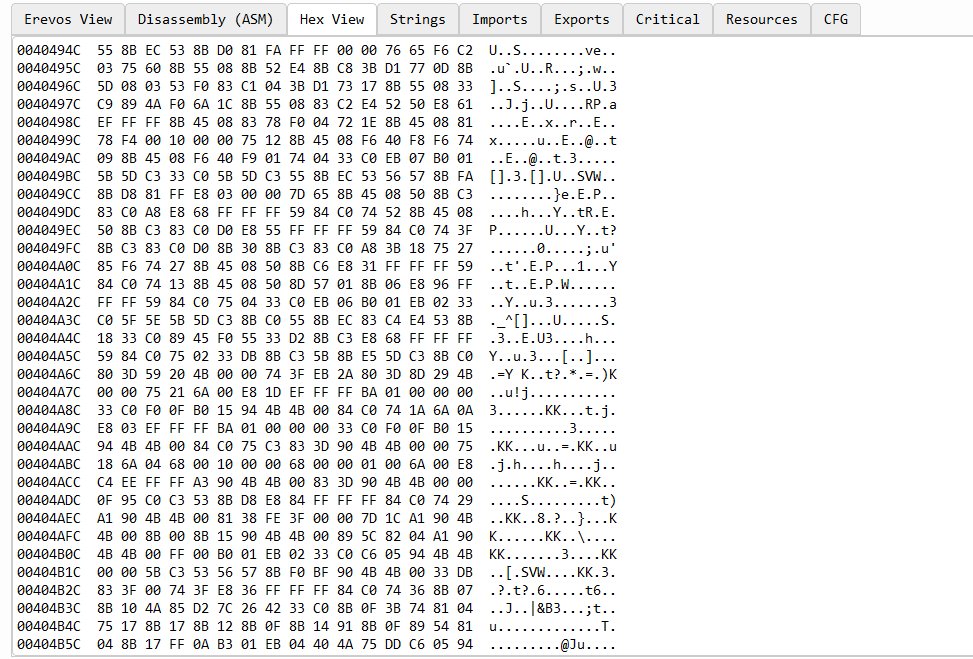

- **Strings Extraction** – list of ASCII/Unicode strings found inside the PE.  
  

- **Imports / Exports Parsing** – all imported and exported functions.  
  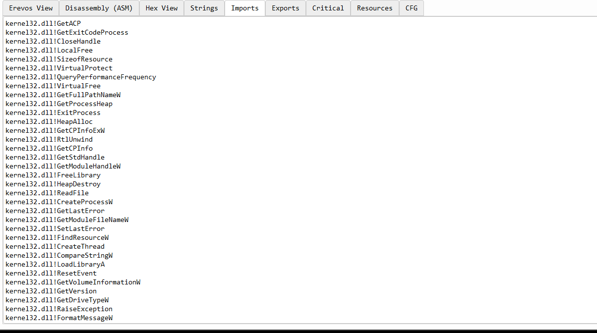  
  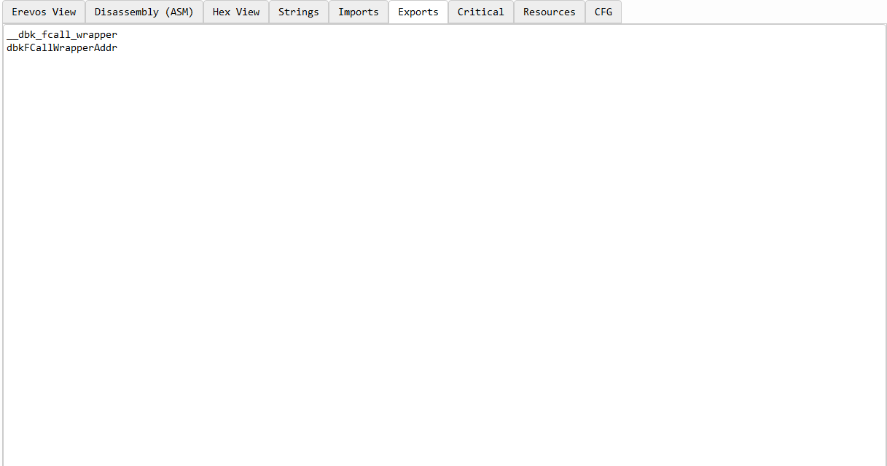

- **Resources Tab** – manifests, icons, dialogs, and version info.  
  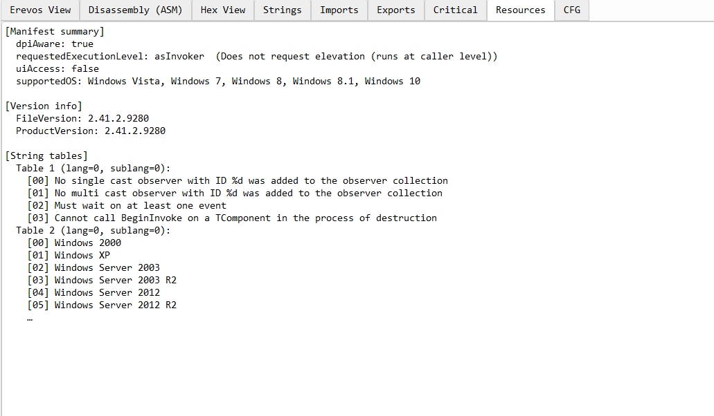

- **Critical Analysis** –  
  - Risk scoring of suspicious APIs and functions.  
    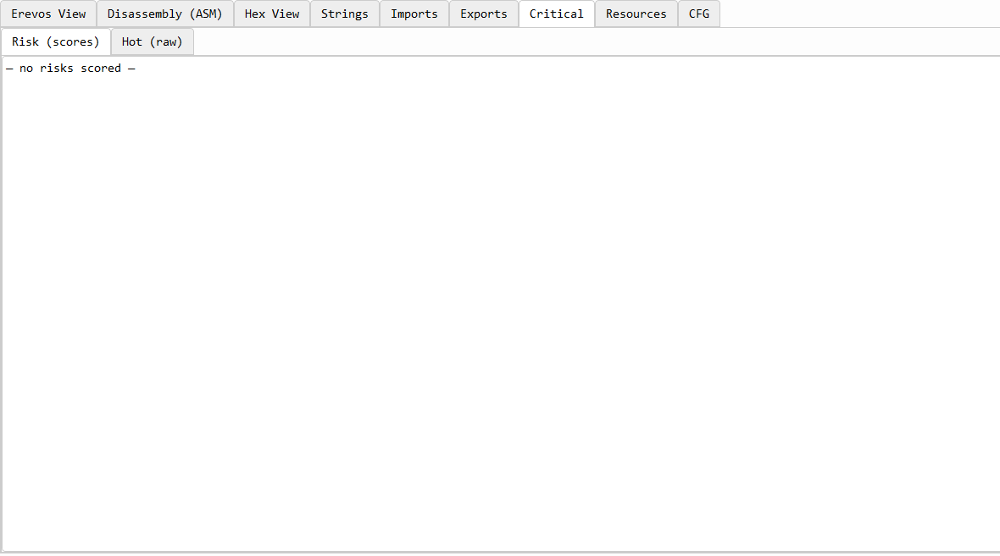  
  - Raw suspicious artifacts.  
    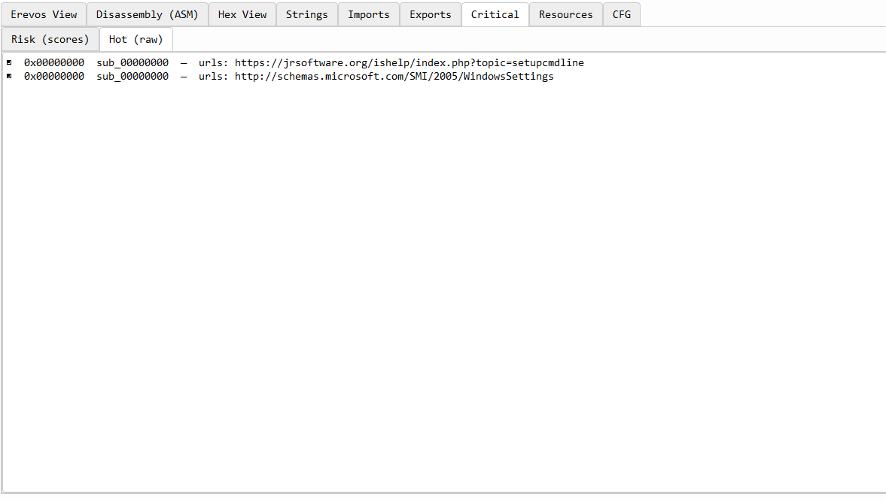

- **Control Flow Graph (CFG)** – visualize function control flow in an interactive graph.  
  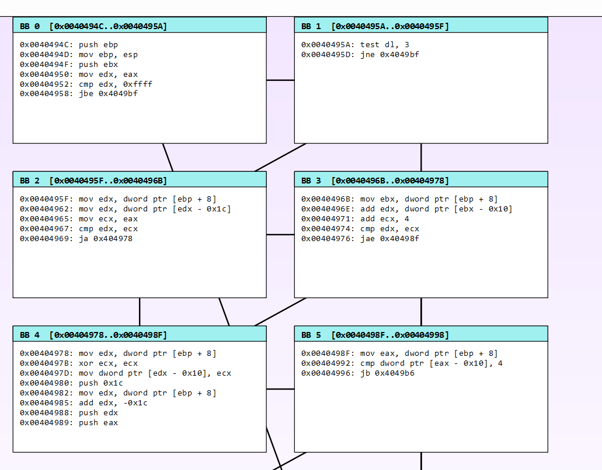  
  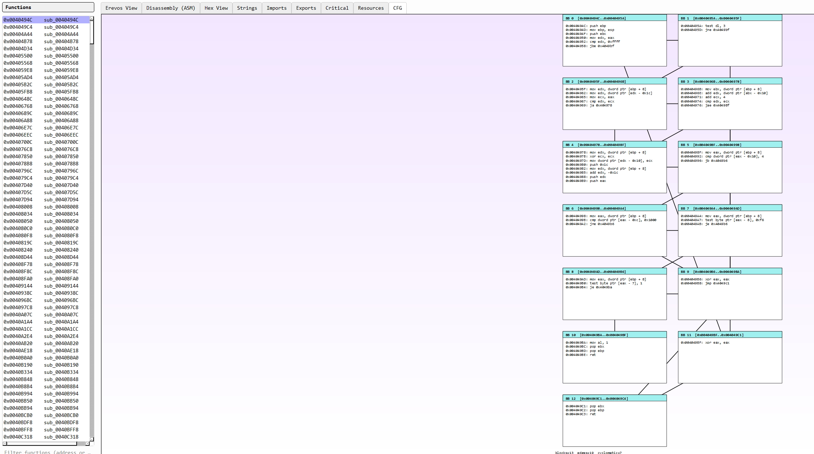

- **HTML Report Export** – generate professional forensic HTML reports.  
  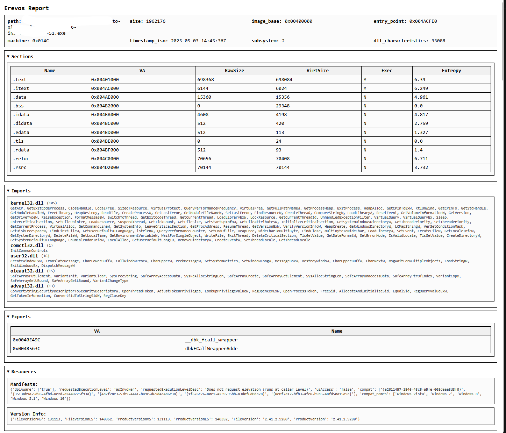  
  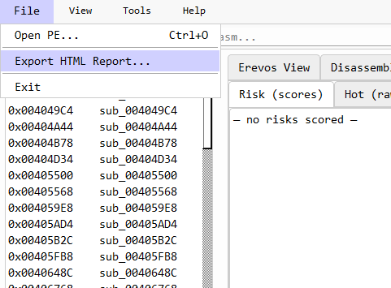

- **Disassembly Export** – save disassembly to `.txt`.  
  

- **Packer/Obfuscation Analysis** – heuristic detection of packing, overlays, and TLS callbacks.  
  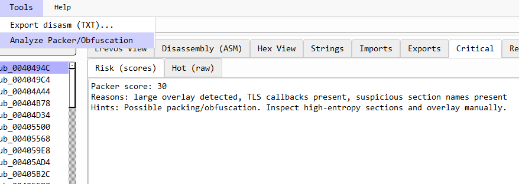

---

## 📖 Usage Guide

1. **Start Erevos**  
   Launch the application and load a PE file via:  
   `File → Open PE…`

2. **Navigate Through Tabs**  
   - **Erevos View** – quick metadata overview.  
   - **ASM** – disassembly with syntax highlighting.  
   - **Hex View** – raw binary inspection.  
   - **Strings / Imports / Exports / Resources** – forensic artifact views.  
   - **Critical** – risk scoring and suspicious artifact detection.  
   - **CFG** – interactive function graph.  

3. **Generate Reports**  
   - Export **HTML report**: `File → Export HTML Report…`  
   - Export **Disassembly (TXT)**: `Tools → Export disasm (TXT)…`

4. **Analysis Tools**  
   - Run `Tools → Analyze Packer/Obfuscation` for heuristic packer detection.  
   - Check the **Critical tab** for flagged APIs, suspicious imports, and risky behavior.

---

## 🚀 Planned Roadmap

- Enhanced CFG export (image/PDF).  
- YARA rules integration.  
- Plugin system for custom analysis modules.  
- Extended risk-scoring heuristics.  

---

## 📜 About

- **Author:** Nikolaos Kranidiotis  
- **Website:** [osec.gr](https://osec.gr)  
- **Contact:** erevos@osec.gr  
- **Version:** v0.1 Preview  

---

## 📌 License

Erevos is distributed for **forensic and research purposes only**.  
Any malicious use is strictly prohibited.
